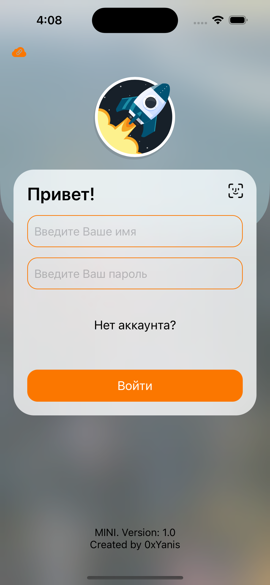
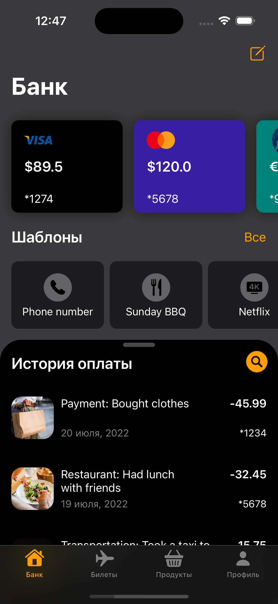
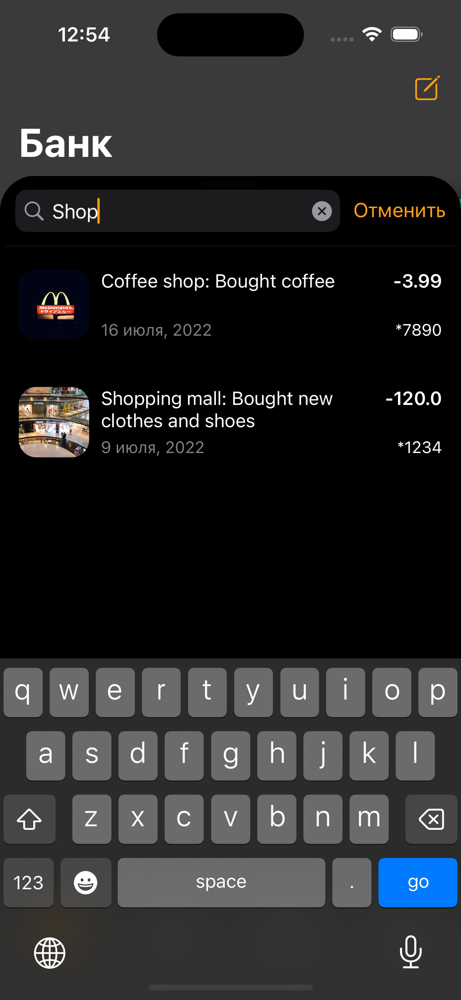
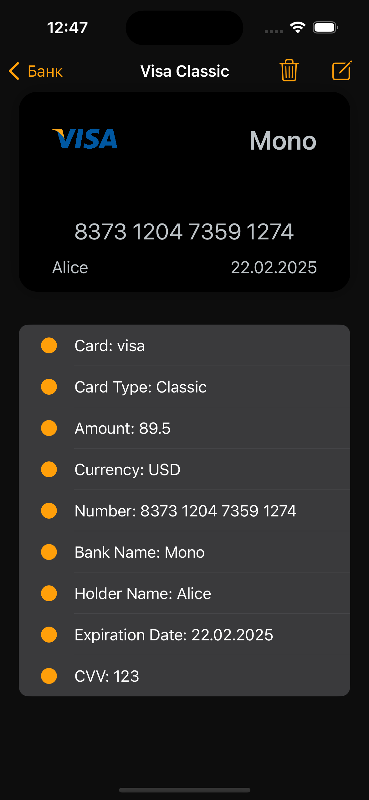
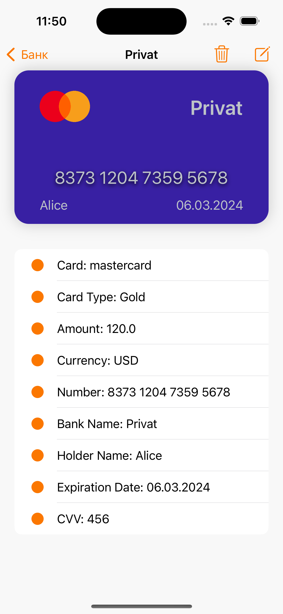
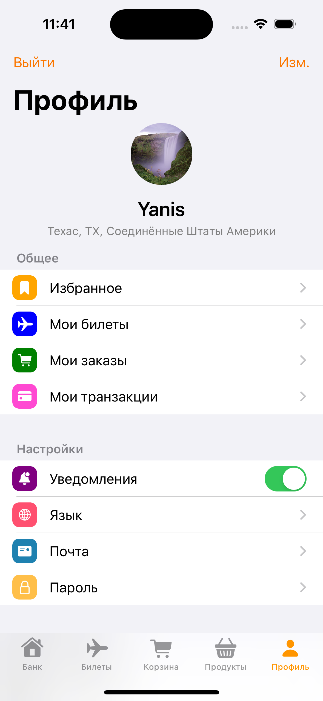

# MINI-SuperApp

## Описание

**MINI Superapp** - ***универсальное приложение для управления финансами, заказа авиабилетов и доставки продуктов. Открывайте банковский счет, совершайте платежи и переводы, бронируйте авиабилеты и заказывайте продукты в удобном мобильном приложении. Оптимизируйте свою жизнь, используя MINI Superapp!***

## Скриншоты

<html>
 <body>
  

    
    
    
    
    
    
  

 </body>
</html>

## Функциональность

- БАНК
  
  Данные карт, шаблоны для оплаты, история транзакций, добавление новых карт и шаблонов оплаты
  
- АВИАБИЛЕТЫ

  ///

- КОРЗИНА

  ///
  
- ДОСТАВКА ПРОДУКТОВ

  Продукты, категории, покупка, корзина, последние покупки, спецпредложения

- ПРОФИЛЬ

  ///

## Технологии

- Swift язык
- VIPER архитектура (VIPER + Builder модули)
- UIKit + SnapKit
- Firebase
- API (Alamofire)
- SDWebImage загрузка и кеширование изображений
- Lottie анимация
- SkeletonView анимация подгрузки
- Keychain для паролей
- FaceID / TouchID быстрый вход
- CoreLocation
- DI
- SOLID
- Clean code
- XCTests
