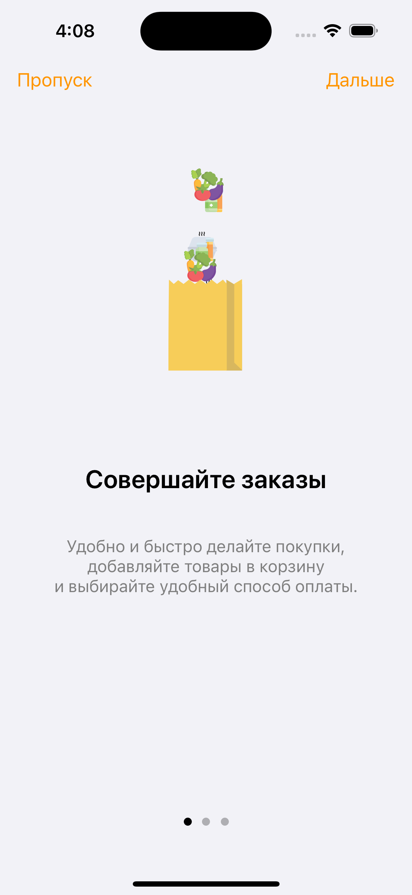

# MINI-SuperApp

## Описание

**MINI Superapp** - ***универсальное приложение для управления финансами, заказа авиабилетов и доставки продуктов. Открывайте банковский счет, совершайте платежи и переводы, бронируйте авиабилеты и заказывайте продукты в удобном мобильном приложении. Оптимизируйте свою жизнь, используя MINI Superapp!***

## Скриншоты

<html>
 <body>
  

    
    
    
    
    
    
    
  

 </body>
</html>

## Функциональность

- БАНК
  
  Данные карт, шаблоны для оплаты, история транзакций, добавление новых карт и шаблонов оплаты
  
- АВИАБИЛЕТЫ

  ///

- КОРЗИНА

  Список всех покупок, сортировка по типу и стоимости, управление корзиной
  
- ДОСТАВКА ПРОДУКТОВ

  Продукты, категории, покупка, корзина, последние покупки, спецпредложения

- ПРОФИЛЬ

  Список избранного, уведомления, удаление учетной записи, выход из учетной записи, смена языка

## Технологии

Архитектура:
- двухуровневая, насыщенный клиент
- Swift, VIPER + Coordinator, DI builder containters
- Сервер: Firebase
- Данные: Realm
- Изображения + кеш: SDWebImage
- Многопоточность: GCD

Безопасность:
- Keychain
- FaceID, TouchID
- Firebase auth

Данные:
- Firebase storage, firestore, Realm
- UserDefaults для хранения переменных состояний приложения

UI:
- UIKit (Layout через SnapKit)

Анимация:
- Lottie
- SkeletonView

SDK:
- MapKit
- CoreLocation
